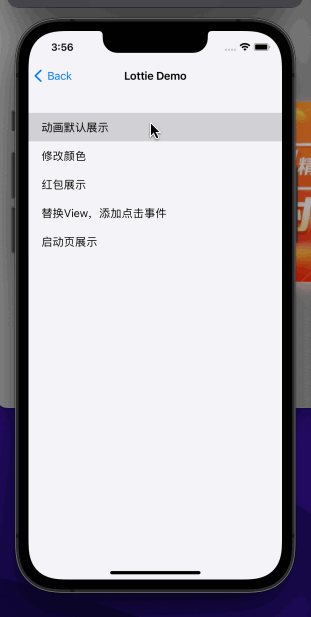
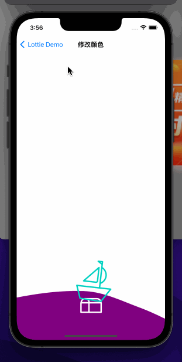
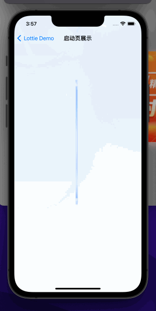

# NrLottieMixView







## Example

To run the example project, clone the repo, and run `pod install` from the Example directory first.

## Requirements

## Installation

NrLottieMixView is available through [CocoaPods](https://cocoapods.org). To install
it, simply add the following line to your Podfile:

```ruby
pod 'NrLottieMixView'
```

## Author

zhuyuhui434@gmail.com, C2021900@pccc.bankcomm.com

## License

NrLottieMixView is available under the MIT license. See the LICENSE file for more info.
